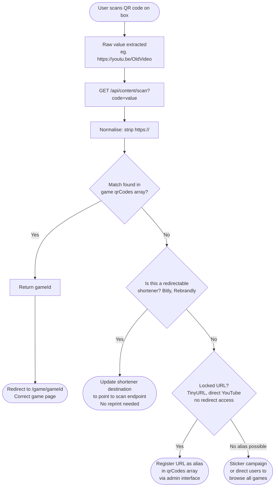

# Trade-offs and Notes

Setup and running instructions are in [README.md](./README.md).

## What I prioritised

I started with the core flow: QR code arrives, right content comes back. Everything else builds on top of that.

Getting the API shape right was more important to me than getting it complete. I modelled the full game document including rules, scoring, timers, sound effects, and expansions so the response is actually useful rather than a stub. A companion app needs that depth otherwise the frontend has nothing meaningful to work with.

I chose to address two of the three challenges, expansion packs and stale QR codes, because they felt like the most interesting design problems and the most likely things to come up in a real production scenario.

For routing I went with URL-based navigation so each game and expansion has its own address. It means deep links work, the browser back button works, and QR codes can point directly to a game page if needed.

The UI is mobile-first because the app is used at a table with a physical game in someone's hands. Large touch targets, readable text size, layout that works at 375px.

## What I deliberately skipped

**Authentication.** No user accounts or sessions. The companion app as described is anonymous, anyone who scans gets the content. Auth only becomes relevant once you add personalisation like saved games, play history, or a checkout flow for buying expansions and new games directly from the app, similar to what bigpotato.tv already offers.

**Server-side caching.** TanStack Query handles client-side caching, which means once a user has loaded a game in their current session the app will not ask the server for it again. However there is no server-side cache in this prototype. In production, if thousands of players all scan the same game at the same time, every one of those requests hits the database directly. Caching at the server level means storing the response for a game (the rules, the scoring, everything) in a fast in-memory store like Redis so the database only needs to be asked once, and every request after that gets the saved answer instead. Game content rarely changes so this is safe to hold for several minutes at a time. A CDN layer like Cloudflare would take this further by serving cached responses from servers physically close to the user, reducing response times globally. This is the biggest gap between the prototype and something ready for real traffic.

**Deep error handling.** The API returns clean 404s and 400s but does not retry on DB timeouts, does not have circuit breaking, and the client cannot distinguish between "game not found" and "the database is down".

**Analytics.** Nothing is logged beyond default Express output. In production this would be the first thing I would add.

## The challenges I picked

### Expansion packs

Expansions are subdocuments inside the game's Mongoose schema rather than a separate collection. This keeps the main game fetch to a single DB query and means expansions are always returned with their parent. The trade-off is that the document grows larger as expansions get more content, but for this domain that is not a real concern.

Discovery starts before a user even taps into a game. The game list endpoint `GET /api/content` includes an `expansionCount` for each game, so the home screen already shows a clear "3 Expansion Packs Available" badge on the game card upfront. Once you're inside a game, a slim highlight banner above the tab bar surfaces the expansion count immediately, so players know what is available before they start reading the rules. `GET /api/content/:gameId` returns a summary of all expansions in the same response with no extra request needed. The client shows these in an Expansions tab with each pack's name and price. Tapping an expansion calls `GET /api/content/:gameId/expansions/:expansionId` to load the full detail only when the user actually wants it, keeping the main game response lean. The detail page shows the price and a Buy Now button that links through to the Big Potato store, closing the loop between discovering an expansion in the app and being able to purchase it.

### Stale QR codes

The problem is that a QR code is printed on a box, shipped to a retailer, sits on a shelf for 18 months, then gets scanned by a customer. The URL it encoded may have pointed to a YouTube video, an old domain, or a campaign page that no longer exists.

The solution is QR alias resolution. Instead of storing a single `qrCode` string on a game, the model stores `qrCodes` as an array of every known identifier for that game. The `/api/content/scan?code=` endpoint queries against this array and returns the `gameId`. This means a game can recognise its old YouTube link, its old domain path, and its new companion app code all through the same endpoint. The QR code on the box becomes decoupled from the content it returns, so Big Potato can re-point their QR platform or domain redirects to the scan endpoint without reprinting a single box.

There are a few scenarios worth calling out. If the QR code was created through a URL shortener or redirect service that Big Potato still has access to, like Bitly or Rebrandly, they can simply update the destination URL in that platform to point to the companion app scan endpoint without touching the box at all. If the QR code was created through a service like TinyURL, which does not allow editing after creation, or if Big Potato no longer has access to the account, that URL is locked and cannot be redirected. The same applies to QR codes that were printed with a YouTube or Instagram URL baked in directly with no redirect layer in between. For those boxes the only options are a sticker campaign with a new QR code or directing users to the manual game list in the app as a fallback.

## What I would productionise with more time

**Caching.** As described above, I would add `Cache-Control` headers to content endpoints, a CDN like Cloudflare or CloudFront to absorb traffic spikes at launch, and Redis as a middle layer for DB query results.

**Instrumentation.** The metrics I would want to see:
- Scan volume per game per hour to know which games are actively being played
- Resolution rate on the `/scan` endpoint to find what percentage of codes are going unresolved, which tells you which boxes in the wild have aliases we do not know about yet
- p95 response time on game content fetches
- Client-side time from scan to content visible, which is the number that actually matters to the player

Structured JSON logs to stdout, a simple `POST /api/events` endpoint for client-side timing, and alerts on unresolved scan rate and error rate.

**Admin interface.** In production you would want a simple internal tool that lets the ops team manage games and their QR aliases without touching the database or the codebase. The data model already supports this since each game stores a `qrCodes` array and the scan endpoint queries against it. The admin UI would cover two areas. First, game management: create or update a game's name, description, rules, expansions, and pricing. Second, QR alias management: search for a game, view its current list of known codes, paste in a new legacy URL and hit save. That URL gets appended to the array and the next scan of that box resolves correctly with no code change, no redeployment, and no reprint of the box. This is the most operationally useful thing to build next because it removes the dependency on an engineer every time a new unresolved QR code is reported in the wild.

**Offline support.** A companion app used at a table does not always have a good signal. A service worker caching the last-fetched game would mean rules are available even without a connection.
