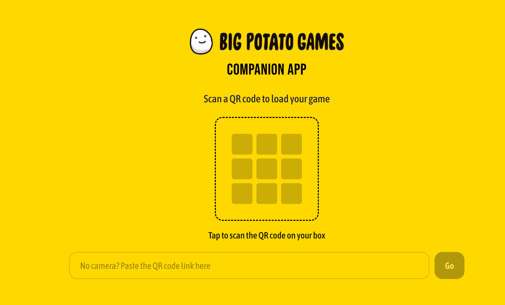
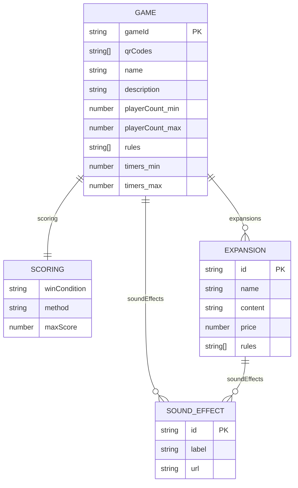

# Big Potato Companion App

A web companion for Big Potato board games. Players scan the QR code on a game box to instantly access rules, scoring, sound effects, timers, and expansion content.



## Project Structure

```
BigPotatoApp/
├── api/        # Express + TypeScript backend (port 3001)
├── web/        # Next.js frontend (port 3000)
└── package.json
```

## Tech Stack

| Layer     | Tech                                      |
|-----------|-------------------------------------------|
| Frontend  | Next.js 16, React 19, TailwindCSS 4      |
| Backend   | Express 5, Node.js 22, TypeScript         |
| Database  | MongoDB Atlas (Mongoose)                  |
| Data      | TanStack Query v5                         |
| Tooling   | ESLint, Prettier, asdf, concurrently      |

## Data Model

All game data lives in a single MongoDB collection. Expansions, sound effects, and scoring are embedded subdocuments — one document per game, one query to load everything.



The `qrCodes` array is the key to stale QR code resolution — every known alias for a game (new codes, legacy YouTube links, old domain paths) is stored here. The `/api/content/scan` endpoint queries against this array to resolve any code to the correct game.

## Prerequisites

- [asdf](https://asdf-vm.com/) with the nodejs plugin
- Node.js 22.15.0 (managed via asdf — see `.tool-versions`)

```bash
asdf plugin add nodejs https://github.com/asdf-vm/asdf-nodejs.git
asdf install nodejs 22.15.0
```

## Getting Started

### 1. Install dependencies

```bash
npm install
npm install --prefix api
npm install --prefix web
```

### 2. Set up environment variables

```bash
cp api/.env.example api/.env
```

Edit `api/.env` and fill in your MongoDB Atlas connection string. Create `web/.env.local`:

```env
NEXT_PUBLIC_API_URL=http://localhost:3001
```

### 3. Seed the database

```bash
npm run seed --prefix api
```

### 4. Run both servers

```bash
npm run dev
```

- Frontend: http://localhost:3000
- API: http://localhost:3001
- API health check: http://localhost:3001/health

### Run individually

```bash
npm run dev:api   # API only
npm run dev:web   # Frontend only
```

## Features

- **In-app QR scanner** — tap the QR frame on the home screen to open the camera and scan directly from the app; no need to use the phone's native camera app
- **QR code resolution** — `/scan?code=<value>` accepts any known alias for a game (new codes, legacy YouTube links, old domain paths) and redirects to the right game page; `https://` prefix is normalised automatically so full URLs and bare paths both match
- **Paste fallback** — no camera? Paste or type the QR code value into the text field to reach the same resolution flow
- **Game discovery** — games are fetched dynamically from the API, no hardcoded list
- **Expansion packs** — expansion count shown on the home screen game cards; highlighted banner above the tabs on the game page; full list in the Expansions tab with prices; each expansion has its own detail page at `/game/[gameId]/[expansionId]` with a Buy Now button linking to the Big Potato store
- **Game tab navigation** — Rules, Scoring, Sounds, and Expansions in a single-page tab layout

## Testing QR Resolution

Paste any of these into the text field on the home screen, or use them as the `code` query param on `/scan`:

**The Chameleon**
- `BP-QR-CHAM-001`
- `https://youtu.be/ChameleonGameVideo`
- `https://www.youtube.com/watch?v=ChameleonGameVideo`
- `https://bit.ly/bpChameleon`
- `https://tinyurl.com/big-potato-chameleon`
- `https://www.instagram.com/p/ChameleonBigPotato`
- `https://www.facebook.com/BigPotatoGames/videos/chameleon-how-to-play`

**Herd Mentality**
- `BP-QR-HERD-001`
- `https://youtu.be/HerdMentalityVideo`
- `https://bit.ly/bpHerdMentality`
- `https://www.tiktok.com/@bigpotatogames/video/herd-mentality-howtoplay`

**Sounds Fishy**
- `BP-QR-FISH-001`
- `https://www.instagram.com/p/SoundsFishyPost`
- `https://bit.ly/bpSoundsFishy`
- `https://tinyurl.com/big-potato-sounds-fishy`

All of these resolve to the correct game page regardless of whether they include `https://` or not.

## Notes

See [NOTES.md](./NOTES.md) for the trade-offs made, what was deliberately skipped, and how the two chosen challenges (expansion packs and stale QR codes) were addressed.
